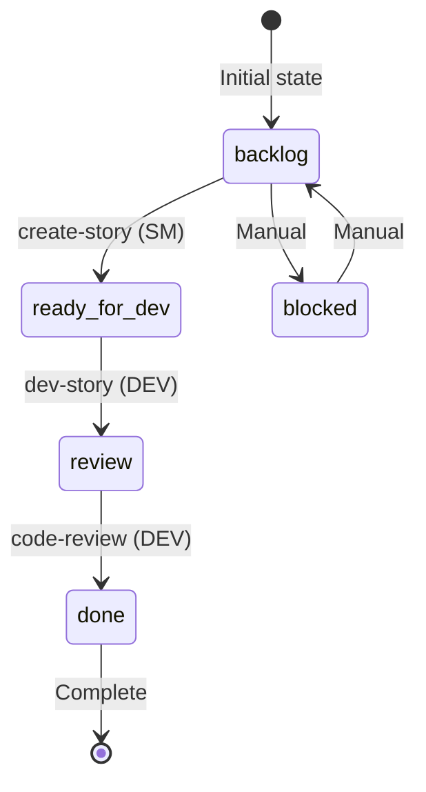
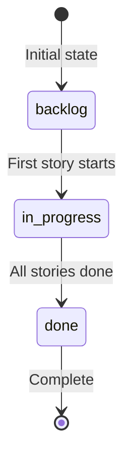

# Workflows Guide

This document explains the workflow system used by BMAD Ralph Loop.

## Table of Contents

- [Overview](#overview)
- [State Machine](#state-machine)
- [Workflow Details](#workflow-details)
- [Agent Roles](#agent-roles)
- [Workflow Customization](#workflow-customization)

---

## Overview

BMAD Ralph Loop orchestrates three main workflows in sequence:

```
┌─────────────┐     ┌─────────────┐     ┌─────────────┐
│   CREATE    │ ──▶ │    DEV      │ ──▶ │   REVIEW    │
│   STORY     │     │   STORY     │     │    CODE     │
│   (SM)      │     │   (DEV)     │     │   (DEV)     │
└─────────────┘     └─────────────┘     └─────────────┘
```

Each workflow is executed by a specific agent and moves the story through defined states.

---

## State Machine

### Story States



### State Transitions

| From State | To State | Trigger | Agent |
|------------|----------|---------|-------|
| `backlog` | `ready-for-dev` | `create-story` workflow | SM |
| `ready-for-dev` | `review` | `dev-story` workflow | DEV |
| `review` | `done` | `code-review` workflow | DEV |
| Any | `blocked` | Manual intervention | Human |
| `blocked` | `backlog` | Manual intervention | Human |

### Epic States



Epics transition automatically:
- `backlog` → `in-progress`: When first story in epic starts
- `in-progress` → `done`: When all stories in epic are `done`

---

## Workflow Details

### 1. Create Story (SM Agent)

**Purpose**: Generate a detailed story file from epic requirements.

**Trigger**: Story status is `backlog`

**Agent**: SM (Scrum Master)

**Input**:
- Epic definition from `_bmad-output/planning-artifacts/epic-{N}.md`
- Story key (e.g., `1-2`)

**Output**:
- Story file at `_bmad-output/implementation-artifacts/{story-key}.md`

**What it does**:
1. Reads the epic definition
2. Identifies the specific story requirements
3. Breaks down into detailed tasks
4. Defines acceptance criteria
5. Creates the story markdown file

**Status change**: `backlog` → `ready-for-dev`

### 2. Dev Story (DEV Agent)

**Purpose**: Implement the story according to specifications.

**Trigger**: Story status is `ready-for-dev`

**Agent**: DEV (Developer)

**Input**:
- Story file from `_bmad-output/implementation-artifacts/{story-key}.md`
- Existing codebase

**Output**:
- Implemented code changes
- Tests (if specified)
- Documentation updates

**What it does**:
1. Reads the story file
2. Analyzes existing codebase
3. Plans implementation approach
4. Writes code
5. Writes tests
6. Updates documentation

**Status change**: `ready-for-dev` → `review`

### 3. Code Review (DEV Agent)

**Purpose**: Review and validate the implementation.

**Trigger**: Story status is `review`

**Agent**: DEV (Developer)

**Input**:
- Story file
- Recent code changes
- Git diff

**Output**:
- Code fixes if needed
- Review completion

**What it does**:
1. Reviews implementation against story requirements
2. Checks code quality
3. Verifies tests pass
4. Fixes any issues found
5. Validates acceptance criteria

**Status change**: `review` → `done`

---

## Agent Roles

### SM (Scrum Master) Agent

**Responsibilities**:
- Sprint planning
- Story creation
- Backlog management
- Retrospectives

**Workflows**:
- `sprint-planning`: Initialize sprint and create status file
- `create-story`: Create detailed story files
- `retrospective`: Run epic retrospectives

**Characteristics**:
- Focuses on requirements and planning
- Does not write implementation code
- Works with planning artifacts

### DEV (Developer) Agent

**Responsibilities**:
- Code implementation
- Testing
- Code review
- Bug fixing

**Workflows**:
- `dev-story`: Implement stories
- `code-review`: Review implementations

**Characteristics**:
- Writes actual code
- Runs tests
- Focuses on technical implementation

---

## Workflow Customization

### Skipping Code Review

```bash
claude-ralph-loop --skip-review
```

This changes the workflow to:
```
backlog → ready-for-dev → done
```

### Processing Specific Stories

Process only one story:
```bash
claude-ralph-loop --story 1-2
```

Process only one epic:
```bash
claude-ralph-loop --epic 1
```

### Manual Status Override

You can manually edit `sprint-status.yaml` to:
- Skip a workflow step
- Re-run a workflow
- Block a story

Example - re-run dev-story:
```yaml
development_status:
  1-1: "ready-for-dev"  # Change from "review" to re-run dev-story
```

### Custom Workflow Prompts

The workflow prompts are defined in `run_claude_workflow()`. Modify for custom behavior:

```bash
run_claude_workflow() {
    local agent="$1"
    local workflow="$2"
    local description="$3"
    local extra_context="${4:-}"

    # Custom prompt
    local prompt="Load the $agent agent and execute the $workflow workflow. $extra_context

CRITICAL: Run in fully autonomous mode. Do NOT ask questions.
# Add your custom instructions here
"
    # ...
}
```

---

## Workflow Sequence Diagram

```
┌──────────┐          ┌────────────┐          ┌───────────────┐
│  Ralph   │          │   Claude   │          │  File System  │
│  Loop    │          │   Code     │          │               │
└────┬─────┘          └─────┬──────┘          └───────┬───────┘
     │                      │                         │
     │  Read sprint-status  │                         │
     │─────────────────────────────────────────────▶ │
     │                      │                         │
     │ ◀─────────────────────────────────────────────│
     │  Return status       │                         │
     │                      │                         │
     │  For each story:     │                         │
     │                      │                         │
     │  1. create-story     │                         │
     │─────────────────────▶│                         │
     │                      │  Write story file       │
     │                      │────────────────────────▶│
     │                      │                         │
     │  Update status       │                         │
     │─────────────────────────────────────────────▶ │
     │                      │                         │
     │  2. dev-story        │                         │
     │─────────────────────▶│                         │
     │                      │  Write code             │
     │                      │────────────────────────▶│
     │                      │                         │
     │  Update status       │                         │
     │─────────────────────────────────────────────▶ │
     │                      │                         │
     │  3. code-review      │                         │
     │─────────────────────▶│                         │
     │                      │  Fix issues             │
     │                      │────────────────────────▶│
     │                      │                         │
     │  Update status       │                         │
     │─────────────────────────────────────────────▶ │
     │                      │                         │
     │  4. git commit       │                         │
     │─────────────────────────────────────────────▶ │
     │                      │                         │
     ▼                      ▼                         ▼
```

---

## Error Handling

### Workflow Failure

If a workflow fails:
1. Status is NOT updated
2. Error is logged
3. User is prompted to continue or abort
4. Story can be retried by running again

### Verification Guards

After each workflow, Ralph Loop verifies:
- **create-story**: Story file exists
- **dev-story**: Git shows modified files
- **code-review**: Workflow completes without error

### Recovery

To recover from a failed workflow:
1. Check logs for error details
2. Optionally manually fix the issue
3. Re-run with the specific story:
   ```bash
   claude-ralph-loop --story X-Y
   ```

---

## Best Practices

1. **Run dry-run first**: Always preview with `--dry-run`
2. **Process incrementally**: Use `--epic` or `--story` for control
3. **Check logs**: Review logs after each run
4. **Commit frequently**: Each story creates a commit
5. **Use verbose mode**: Add `--verbose` when debugging
